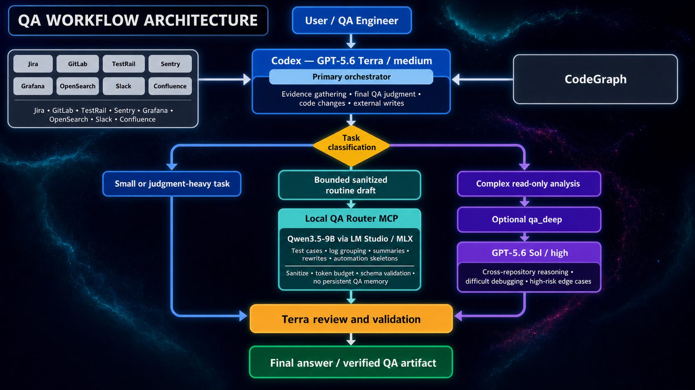

# QA Router MCP

[English](README.md) | [Deutsch](README.de.md) | [Русский](README.ru.md) | **Español**

Un servidor MCP local centrado en la privacidad que delega desde Codex a Qwen3.5-9B, mediante LM Studio y MLX, tareas acotadas y anonimizadas de redacción para QA. Codex sigue siendo el orquestador principal y se encarga de recopilar evidencias, emitir el juicio final de QA, modificar el código y realizar cualquier escritura en sistemas externos.



## Arquitectura

- **Orquestador principal:** Codex con GPT-5.6 Terra y razonamiento `medium`.
- **Borradores rutinarios locales:** Qwen3.5-9B mediante LM Studio/MLX, accesible únicamente por loopback.
- **Escalado complejo:** un agente opcional `qa_deep`, de solo lectura, con GPT-5.6 Sol y razonamiento `high`.
- **Sistemas fuente:** Jira, GitLab, TestRail, Sentry, Grafana, OpenSearch, Slack y Confluence permanecen bajo el control de Codex mediante sus integraciones MCP.
- **Navegación por el código:** Codex utiliza CodeGraph cuando existe un índice aplicable al proyecto.

El router no entrena el modelo, no guarda el historial de la conversación ni crea memoria persistente de QA. Cada resultado local es un borrador sin verificar que Codex debe revisar.

## Qué se enruta localmente

| Herramienta | Propósito | Límite de entrada | Salida máxima |
|---|---|---:|---:|
| `draft_test_cases` | Convierte un mapa de cobertura aprobado por Terra en texto de casos de prueba | 20.000 caracteres | 3.072 tokens |
| `summarize_logs` | Agrupa firmas visibles de logs sin inventar causas raíz | 40.000 caracteres | 1.536 tokens |
| `draft_automation_skeleton` | Crea un esqueleto sin escritura a partir de un patrón explícito del proyecto | 20.000 caracteres | 3.072 tokens |
| `translate_text` | Traduce texto anonimizado conservando la terminología | 12.000 caracteres | 1.536 tokens |
| `rewrite_text` | Acorta, corrige o reformula sin añadir hechos | 12.000 caracteres | 1.536 tokens |
| `explain_short` | Explica brevemente un tema estable | 6.000 caracteres | 512 tokens |
| `summarize_text` | Produce un resumen limitado al contenido de la fuente | 24.000 caracteres | 2.048 tokens |

El enrutamiento automático es deliberadamente selectivo:

- 4–12 casos de prueba;
- logs a partir de 6.000 caracteres;
- resúmenes basados en una fuente a partir de 4.000 caracteres;
- traducciones o reformulaciones a partir de 2.000 caracteres;
- esqueletos de automatización solo con un patrón explícito del proyecto y un escenario de varios pasos.

Las tareas más pequeñas permanecen en Terra. `explain_short` solo se usa localmente cuando se solicita de forma explícita. Una petición explícita al modelo local puede superar los umbrales de tamaño, pero nunca las restricciones de seguridad.

## Límites de seguridad

- Se rechazan secretos e indicios de datos personales o de pago.
- Las claves de incidencias, URL, direcciones de correo, hashes de commits, ramas y rutas locales se sustituyen antes de la petición local.
- El prompt anonimizado completo se tokeniza con el modelo local seleccionado antes de generar.
- Los tokens del prompt, el presupuesto adaptativo de salida y una reserva de 512 tokens deben caber en el contexto verificado de 16K.
- Los logs solo contienen metadatos y contadores, nunca el texto de prompts o respuestas.
- Nunca deben enviarse credenciales, cookies, tokens, datos personales o de pago, repositorios completos ni documentos corporativos sin limitar.
- Codex valida evidencias, cobertura, severidad, preparación de la versión, cambios de código y acciones externas.

## Requisitos

- macOS sobre Apple Silicon;
- Python 3.12 o posterior;
- [`uv`](https://docs.astral.sh/uv/);
- LM Studio con la CLI `lms`;
- Codex Desktop;
- el modelo `qwen/qwen3.5-9b` descargado en LM Studio.

## Instalación

### 1. Clonar y verificar

```bash
git clone https://github.com/Rbkmen/qa-router-mcp.git
cd qa-router-mcp
uv sync
uv run pytest -q
uv run ruff check .
```

### 2. Iniciar el runtime local

Instala el runtime headless oficial de LM Studio si es necesario:

```bash
curl -fsSL https://lmstudio.ai/install.sh | bash
lms daemon up
lms server start
```

Comprueba que el modelo esté disponible:

```bash
lms ls
```

Carga el perfil de referencia:

```bash
lms load qwen/qwen3.5-9b \
  --context-length 16384 \
  --gpu max \
  --parallel 1 \
  --ttl 300 \
  -y
```

La API debe escuchar únicamente en `127.0.0.1:1234`. La carga JIT permite cargar el modelo con la primera petición y descargarlo tras cinco minutos de inactividad.

### 3. Opcional: iniciar llmster al iniciar sesión

```bash
mkdir -p "$HOME/Library/LaunchAgents"
cp launchd/com.qa-router.llmster.plist "$HOME/Library/LaunchAgents/"
launchctl bootstrap "gui/$(id -u)" \
  "$HOME/Library/LaunchAgents/com.qa-router.llmster.plist"
```

### 4. Instalar la skill de enrutamiento de Codex

```bash
mkdir -p "$HOME/.codex/skills/qa-local-routing"
cp codex/skills/qa-local-routing/SKILL.md \
  "$HOME/.codex/skills/qa-local-routing/SKILL.md"
```

### 5. Registrar el servidor MCP en Codex

Obtén la ruta absoluta del clon con `pwd` y añade el siguiente bloque a la configuración de Codex:

```toml
[mcp_servers.qa-router]
command = "/absolute/path/to/qa-router-mcp/scripts/qa-router-mcp"
args = []
startup_timeout_sec = 30
tool_timeout_sec = 120
```

Reinicia Codex Desktop después de cambiar la configuración.

## Configuración del runtime

El launcher utiliza valores predeterminados seguros y acepta estas variables de entorno:

| Variable | Valor predeterminado |
|---|---|
| `QA_ROUTER_MODEL` | `qwen/qwen3.5-9b` |
| `QA_ROUTER_CONTEXT` | `16384` |
| `QA_ROUTER_MAX_OUTPUT` | `3072` |
| `QA_ROUTER_LMSTUDIO_URL` | `http://127.0.0.1:1234` |
| `QA_ROUTER_TIMEOUT` | `90` |
| `QA_ROUTER_TTL_SECONDS` | `300` |
| `QA_ROUTER_CONTEXT_RESERVE` | `512` |
| `QA_ROUTER_DATA_DIR` | `$HOME/.qa-router` |

El modelo, el contexto, el endpoint loopback y la generación en serie están fijados al perfil verificado.

## Validación y fallback

- Los fallos de transporte se reintentan una vez.
- Un JSON no válido recibe como máximo un intento de reparación del esquema.
- Un borrador de QA incompleto recibe como máximo un intento de reparación semántica.
- La salida de casos de prueba debe coincidir con la longitud del mapa de cobertura y sus campos obligatorios.
- Los esqueletos de automatización se rechazan si contienen escrituras externas explícitas.
- Los fallos de seguridad, presupuesto de contexto, tokenizer, transporte, truncado, esquema o validación devuelven el control a Codex.

## Métricas

Los eventos operativos anonimizados se guardan en `$HOME/.qa-router/metrics.jsonl`. No se registran textos de prompts, borradores, claves de incidencias, código, logs ni rutas.

Generar un informe de siete días:

```bash
uv run qa-router-report
```

Ejecutar el benchmark de regresión en vivo opcional de 28 casos:

```bash
QA_ROUTER_BENCHMARK=1 uv run pytest -q tests/test_live_benchmark.py -s
```

Guardar las métricas del benchmark junto con las métricas interactivas:

```bash
QA_ROUTER_DATA_DIR="$HOME/.qa-router" \
QA_ROUTER_BENCHMARK=1 \
uv run pytest -q tests/test_live_benchmark.py -s
```

## Desactivar la delegación local

```bash
mkdir -p "$HOME/.qa-router"
touch "$HOME/.qa-router/disabled"
```

Reinicia Codex Desktop. Elimina el archivo marcador para volver a activar la delegación local.

## Desinstalar la integración

1. Retira `com.qa-router.llmster` de launchd y elimina su plist de `$HOME/Library/LaunchAgents`.
2. Elimina el bloque `[mcp_servers.qa-router]` de la configuración de Codex.
3. Elimina `$HOME/.codex/skills/qa-local-routing`.
4. Reinicia Codex Desktop.

## Perfil de referencia

El perfil de regresión actual utiliza Qwen3.5-9B 4-bit, un contexto lógico de 16K, una generación en serie, thinking desactivado y un TTL de 300 segundos. Se validó sobre Apple Silicon con 24 GB de memoria unificada, LM Studio 0.4.23 y MLX runtime 1.11.0.

La suite de regresión en vivo valida la estructura de salida, el cumplimiento de las políticas, el comportamiento limitado a la fuente, los contratos de fallback y la ausencia de memoria persistente de la aplicación. No sustituye una revisión experta de QA.
