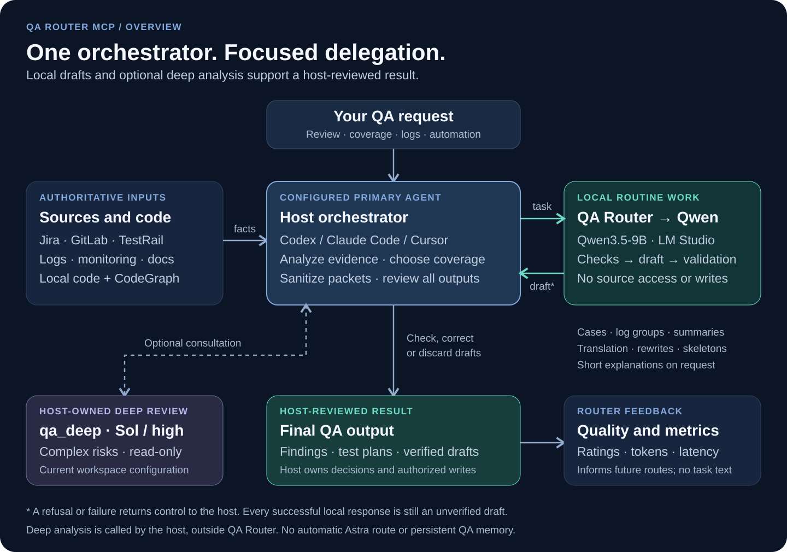
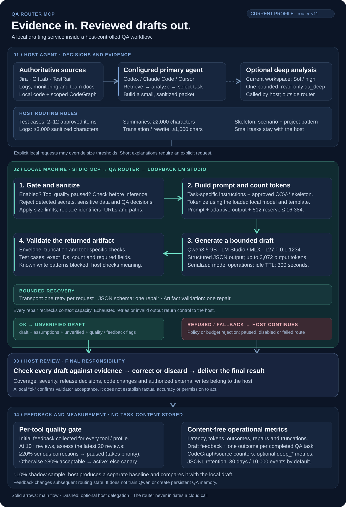

# QA Router MCP

A privacy-aware local MCP server that delegates bounded, sanitized QA drafting tasks from AI coding agents to Qwen3.5-9B through LM Studio and MLX. The calling agent remains the primary orchestrator and owns evidence gathering, final QA judgment, code changes, and every external-system write.

## Architecture at a glance

[](docs/assets/qa-router-overview.svg)

[Open overview SVG](docs/assets/qa-router-overview.svg)

## Detailed workflow

[](docs/assets/qa-router-workflow.svg)

[Open full-size SVG](docs/assets/qa-router-workflow.svg)

## How a request moves through QA Router

1. **The host gathers evidence and decides what to delegate.** Codex, Claude Code, Cursor, or another MCP client reads the relevant sources and code. Its routing instructions select sufficiently large routine tasks and prepare a minimal sanitized packet. For test cases, the host decides coverage first and supplies stable `COV-*` IDs. These routing thresholds are client instructions; they are separate from server-side input limits.
2. **The local MCP server checks the request.** QA Router checks whether delegation is enabled and the tool is paused, rejects detected sensitive data and prohibited decision requests, enforces input limits, and replaces recognized identifiers. It builds a task-specific prompt and verifies that prompt tokens, the adaptive output budget, and a 512-token reserve fit the 16,384-token context.
3. **Qwen produces a draft.** The server calls `qwen/qwen3.5-9b` through loopback LM Studio/MLX with structured JSON output. Model operations are serialized. Transport failures receive one retry per request; schema and artifact errors have bounded repair attempts, with context capacity checked again before each repair.
4. **Validation returns a draft or hands control back.** Successful results include `draft`, `assumptions`, `unverified`, and quality/feedback flags. Test cases must match the requested IDs, count, and required fields; automation drafts are checked for known write patterns. A policy refusal or runtime/validation failure returns control to the host. An `ok` result means the automated checks passed, not that the content is factually proven.
5. **The host reviews and records the outcome.** It checks the draft against evidence, corrects or discards it, and owns the final answer and any authorized external writes. Requested draft feedback updates the per-tool quality gate. A separate task-outcome event records content-free counters; available `deep_*` fields identify optional client-owned deep analysis. The router never invokes a cloud model, trains Qwen, or stores task content as QA memory.

The diagram shows the current workspace's optional read-only Sol/high `qa_deep` role. That role is configured by the host client, not by QA Router. Astra is a possible comparison candidate; this diagram does not imply that an Astra route is enabled.

## Reference architecture

- **Primary orchestrator:** an MCP-capable host agent selected by the client configuration.
- **Local routine drafts:** Qwen3.5-9B through loopback-only LM Studio/MLX.
- **Complex escalation:** client-owned and optional. The router records the selected deep model and reasoning level without choosing or invoking that model.
- **Source systems:** Jira, GitLab, TestRail, Sentry, Grafana, OpenSearch, Slack, and Confluence remain under host-agent control through their integrations.
- **Code navigation:** CodeGraph can be used by the host agent when an applicable project index exists.

The router does not train the model, store conversation history, or create persistent QA memory. Every local result is an unverified draft that the host agent must review.

## Supported AI clients

The same STDIO server works with any compatible MCP client. Each client needs its own connection configuration and persistent routing instructions:

- [Codex](docs/clients/codex.md)
- [Claude Code](docs/clients/claude-code.md)
- [Cursor](docs/clients/cursor.md)
- [Generic MCP client](docs/clients/generic-mcp.md)

All clients share one authoritative [routing policy](docs/ROUTING_POLICY.md). Client templates live under [`client-rules/`](client-rules/).

## What is routed locally

| Tool | Purpose | Input limit | Maximum output |
|---|---|---:|---:|
| `draft_test_cases` | Expand a host-agent-approved coverage map with stable `COV-*` IDs into test-case prose | 20,000 chars | 3,072 tokens |
| `summarize_logs` | Group visible log signatures without inventing root causes | 40,000 chars | 1,536 tokens |
| `draft_automation_skeleton` | Draft a non-writing skeleton from an explicit project pattern | 20,000 chars | 3,072 tokens |
| `translate_text` | Translate sanitized text while preserving terminology | 12,000 chars | 1,536 tokens |
| `rewrite_text` | Shorten, correct, or restyle text without adding facts | 12,000 chars | 1,536 tokens |
| `explain_short` | Explain a stable topic briefly | 6,000 chars | 512 tokens |
| `summarize_text` | Produce a source-bound summary | 24,000 chars | 2,048 tokens |
| `get_metrics_report` | Read content-free operational metrics for a positive time window | — | — |

The automatic route is intentionally limited to routine, reviewable drafts:

- 2–12 approved test cases;
- logs from 3,000 characters;
- source-bound summaries from 2,000 characters;
- translations or rewrites from 1,000 characters;
- automation skeletons only when an explicit project pattern and a multi-step scenario are provided.

Smaller tasks stay in the host agent. `explain_short` is local only when explicitly requested. An explicit local-model request may override size thresholds, but never policy restrictions.

## Safety boundaries

- Secrets and indicators of PII or payment data are rejected.
- Sensitive refusals expose only a coarse category and never echo the matched value.
- Issue keys, URLs, email addresses, commit hashes, branches, and local paths are replaced before a local request.
- The full sanitized prompt is tokenized with the selected local model before every initial or repair generation.
- Prompt tokens, adaptive output budget, and a 512-token reserve must fit the verified 16K context.
- Logs contain metadata and counters only, never prompt or response text.
- Credentials, cookies, tokens, personal or payment data, full repositories, and unrestricted corporate documents must never be sent to the local route.
- The host agent validates evidence, coverage, severity, release readiness, code changes, and external actions.

## Requirements

- macOS on Apple Silicon;
- Python 3.12 or newer;
- [`uv`](https://docs.astral.sh/uv/);
- LM Studio with the `lms` CLI;
- a supported MCP-capable AI client;
- the `qwen/qwen3.5-9b` model downloaded in LM Studio.

## Installation

### 1. Clone and verify

```bash
git clone https://github.com/Rbkmen/qa-router-mcp.git
cd qa-router-mcp
uv sync
uv run pytest -q
uv run ruff check .
```

### 2. Start the local runtime

Install LM Studio's official headless runtime if needed:

```bash
curl -fsSL https://lmstudio.ai/install.sh | bash
lms daemon up
lms server start
```

Verify that the model is available:

```bash
lms ls
```

Load the reference profile:

```bash
lms load qwen/qwen3.5-9b \
  --context-length 16384 \
  --gpu max \
  --parallel 1 \
  --ttl 300 \
  -y
```

The API must listen only on `127.0.0.1:1234`. JIT loading allows the model to load on the first request and unload after five minutes of inactivity.

### 3. Optional: start llmster at login

```bash
mkdir -p "$HOME/Library/LaunchAgents"
cp launchd/com.qa-router.llmster.plist "$HOME/Library/LaunchAgents/"
launchctl bootstrap "gui/$(id -u)" \
  "$HOME/Library/LaunchAgents/com.qa-router.llmster.plist"
```

### 4. Connect your AI client

Find the clone's absolute path with `pwd`, then follow the client-specific setup:

- [Codex setup](docs/clients/codex.md)
- [Claude Code setup](docs/clients/claude-code.md)
- [Cursor setup](docs/clients/cursor.md)
- [Generic MCP setup](docs/clients/generic-mcp.md)

## Runtime configuration

The launcher uses safe defaults and accepts these environment variables:

| Variable | Default |
|---|---|
| `QA_ROUTER_MODEL` | `qwen/qwen3.5-9b` |
| `QA_ROUTER_CONTEXT` | `16384` |
| `QA_ROUTER_MAX_OUTPUT` | `3072` |
| `QA_ROUTER_LMSTUDIO_URL` | `http://127.0.0.1:1234` |
| `QA_ROUTER_TIMEOUT` | `90` |
| `QA_ROUTER_TTL_SECONDS` | `300` |
| `QA_ROUTER_CONTEXT_RESERVE` | `512` |
| `QA_ROUTER_DATA_DIR` | `$HOME/.qa-router` |
| `QA_ROUTER_METRICS_RETENTION_DAYS` | `30` |
| `QA_ROUTER_METRICS_MAX_EVENTS` | `10000` |

The model, context, loopback endpoint, and single-generation parallelism are pinned to the verified profile.

## Validation and fallback

- Transport failures are retried once.
- Invalid JSON receives at most one schema-repair attempt.
- Incomplete QA drafts receive at most one semantic-repair attempt.
- Test-case output must match the requested coverage-map length, required fields, and exact one-to-one set of stable coverage IDs.
- Automation skeletons are rejected if they contain explicit external writes.
- Policy, context-budget, tokenizer, transport, truncation, schema, and validation failures return control to the host agent.

## Metrics

Anonymous operational events are stored in `$HOME/.qa-router/metrics.jsonl`. Prompt text, generated drafts, issue keys, code, logs, and paths are not recorded. The file retains the latest 30 days and at most 10,000 events by default.

The router records model loading, tokenization, generation, validation, repair, and total latency separately. For LM Studio, `cold_start_likely` is based on the loaded-model list immediately before acquisition; `model_load_ms` measures that cold acquisition. Alternate test backends fall back to a process-local idle-time heuristic.

Each tool has an automatic `active`, `canary`, or `paused` quality state based on its latest reviewed drafts. Every tool in a new profile requests feedback for its first 10 reviewed drafts, including routes that start active. After that, a deterministic 10% shadow sample asks the host agent to create an independent baseline; QA Router never triggers a hidden cloud call. Qwen token usage is recorded with generation events; host instructions also record one content-free QA task outcome so Qwen use, edits, source calls, CodeGraph calls, findings, and repeated reads can be evaluated after enough real work. Deep-analysis outcomes use model-neutral `deep_*` fields so Sol, Astra, or another client-owned model can be compared. When measurable, QA task outcomes include aggregate CodeGraph and source-response token counters; CodeGraph savings remain an explicitly labelled estimate, not a counterfactual fact.

Generate a seven-day report:

```bash
uv run qa-router-report
```

Choose another positive window with `--days`, for example `uv run qa-router-report --days 30`.

Run the opt-in 28-case live regression benchmark:

```bash
QA_ROUTER_BENCHMARK=1 uv run pytest -q tests/test_live_benchmark.py -s
```

To store benchmark metrics with interactive metrics:

```bash
QA_ROUTER_DATA_DIR="$HOME/.qa-router" \
QA_ROUTER_BENCHMARK=1 \
uv run pytest -q tests/test_live_benchmark.py -s
```

## Disable local delegation

```bash
mkdir -p "$HOME/.qa-router"
touch "$HOME/.qa-router/disabled"
```

Restart the host AI client. Remove the marker file to enable local delegation again.

## Uninstall the integration

1. Boot out `com.qa-router.llmster` and remove its plist from `$HOME/Library/LaunchAgents`.
2. Remove the `qa-router` MCP entry from the host client's configuration.
3. Remove the installed client-specific routing rule or skill.
4. Restart the host client.

## Reference profile

The current regression profile uses Qwen3.5-9B 4-bit, a 16K logical context, one serialized generation, thinking disabled, and a 300-second TTL. It was validated on Apple Silicon with 24 GB unified memory, LM Studio 0.4.23, and MLX runtime 1.11.0.

The live regression suite validates output structure, required and forbidden semantic anchors, exact coverage IDs, policy enforcement, source-bounded behavior, fallback contracts, and the absence of persistent application memory. It does not replace expert QA review.

## Contributing

Contributions are welcome. See [CONTRIBUTING.md](CONTRIBUTING.md) for development setup, architecture guardrails, testing requirements, and pull-request guidance.
